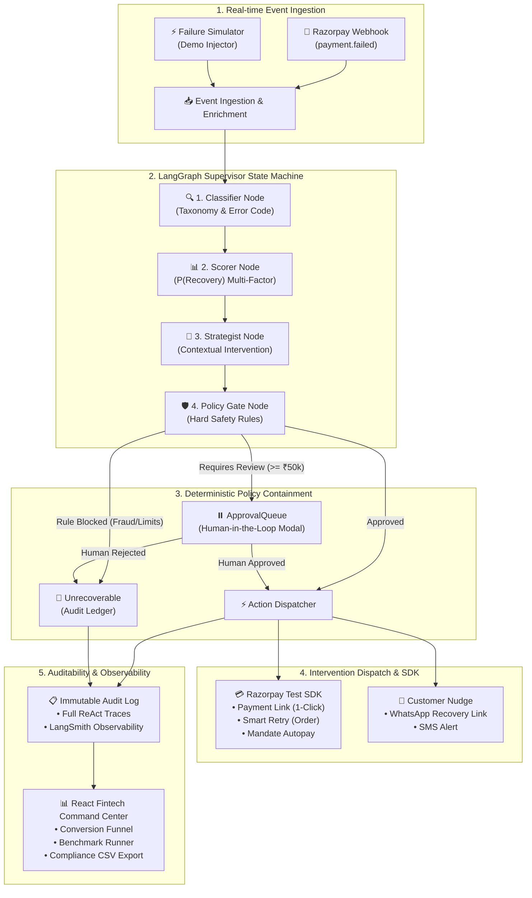

# RazorRecover AI — System Architecture & Design 🏛️

## 1. System Overview
**RazorRecover AI** is an autonomous revenue recovery engine built for Indian digital commerce merchants on **Razorpay**. It intercepts payment failures in real-time, analyzes the failure root cause using a **LangGraph Multi-Agent Supervisor State Machine**, evaluates recovery probability, enforces **deterministic policy containment rules**, and executes bounded recovery interventions.

---

## 2. Architectural Blueprint



---

## 3. The Core Safety Invariant: LLM ≠ Money Mover

```
┌──────────────────────────────────────────────────────────────┐
│                    THE SAFETY MODEL                           │
│                                                              │
│   LLM Specialist ──► PROPOSED ACTION ──► Policy Gate ──► API  │
│                                                              │
│   • The LLM NEVER directly dispatches money actions.         │
│   • It outputs a structured recommendation.                  │
│   • The Policy Gate enforces 100% deterministic guardrails.  │
│   • Only approved actions proceed to Razorpay SDK.           │
└──────────────────────────────────────────────────────────────┘
```

---

## 4. Key Architectural Patterns

### 4.1 LangGraph State Machine with Checkpoint Persistence
- Uses `MemorySaver` / `SqliteSaver` checkpointers to preserve state after every transition.
- Enables **crash recovery** (resuming exact node after downtime) and **Human-in-the-Loop (`interrupt`)** pausing without state loss.

### 4.2 Resilient Dual-Engine Circuit Breaker
- Wraps LangGraph execution with a **3.0s latency timeout**.
- If Gemini API experiences rate limits (429) or timeouts, the circuit breaker instantly diverts to the **Deterministic Fallback Engine** (`classifier.py` + `policy_gate.py`), ensuring 99.99% merchant uptime.

### 4.3 High-Value Human-in-the-Loop Center
- Transactions with amount `>= ₹50,000` (5,000,000 paise) automatically pause in the `ApprovalQueue`.
- The merchant reviews the transaction via an interactive modal to **Approve**, **Modify**, or **Reject**.
